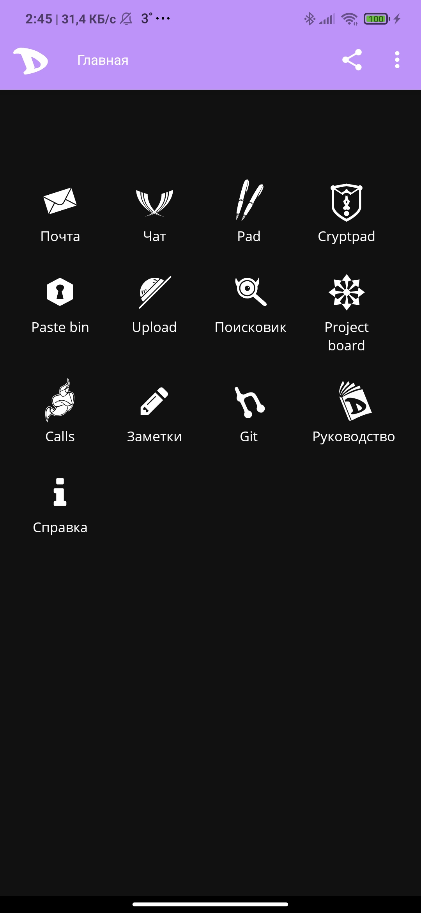
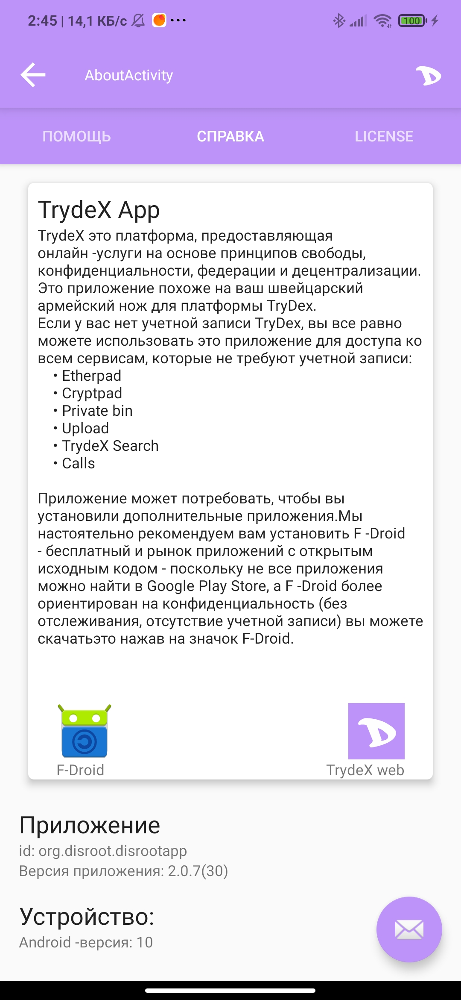
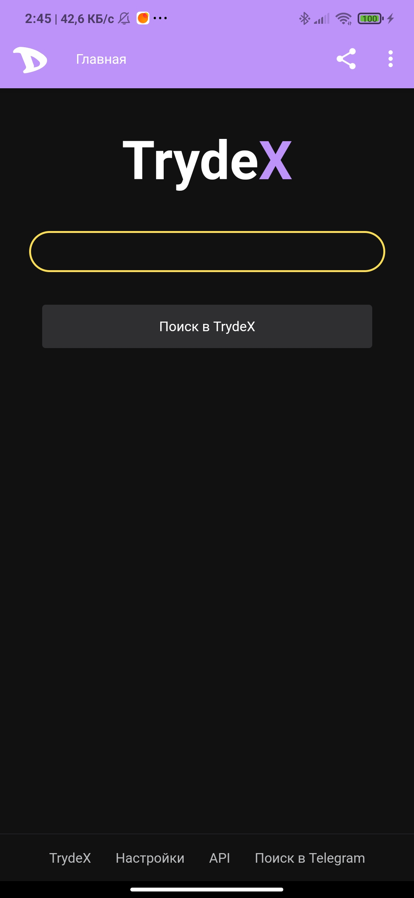

# TrydeX приложение
**TrydeX** Предоставляет ряд онлайн -сервисов, большинство из которых связаны с учетной записью пользователя и могут использоваться через собственного мобильного клиента (например, вы можете получить доступ и использовать электронную почту из нескольких приложений по электронной почте).Но есть также некоторые услуги, которые не требуют входа в систему или еще не имеют специально разработанного приложения.

**TrydeXApp** Работает как своего рода цифровой швейцарский армейский нож: от него доступны все услуги, предлагая установить дополнительное программное обеспечение (если нет уже установленного или настроенного) и обеспечивает лучший опыт для тех, у кого нет конкретного приложения через **Android WebView ** (компонент, который позволяет получить доступ к веб -контенту в приложении).

Он также может быть использован для доступа к всем сервисам **TrydeX**, которые не требуют учетной записи:
* Etherpad
* Cryptpad
* Calls
* Private bin
* Upload
* TrydeX Seach

#### Поддерживаемые языки:
* Russian
* English
* Spanish
* French
* Italian
* Portuguese
* Dutch
* Serbian

Приложение может потребоваться для установки дополнительных приложений. Мы настоятельно рекомендуем установить их из [**f-droid**] (https://f-droid.org/), бесплатного и открытого магазина приложений. Его можно скачать [здесь](https://f-droid.org/fdroid.apk).

---
### Лицензирование
[License GPLv3-only](https://github.com/LencoDigitexer/trydex_app/src/branch/master/LICENCE.txt)

### Требования к устройству
Android 4.1 или +

6 МБ свободной памяти на смартфоне

---
### Конфиденциальность и разрешения
Это приложение требует доступа к Интернету и к внешнему хранилищу, чтобы иметь возможность загружать и загружать файлы.

---
### Участники
Проект всегда открыт для взносов и принимает запросы на привлечение.

---
### Ресурсы
* TrydeXApp: [Ошибки и проблемы](https://github.com/LencoDigitexer/trydex_app/issues)
* TrydeX Проект: [Search](https://trydex.tk)

---
### Screenshots

---
### Maintainers
- [LencoDigitexer](https://github.com/LencoDigitexer)
